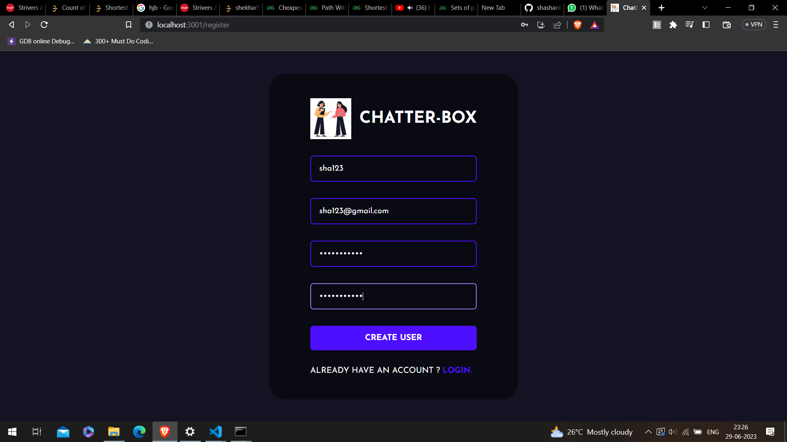
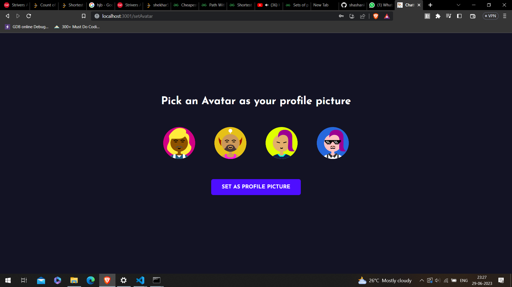
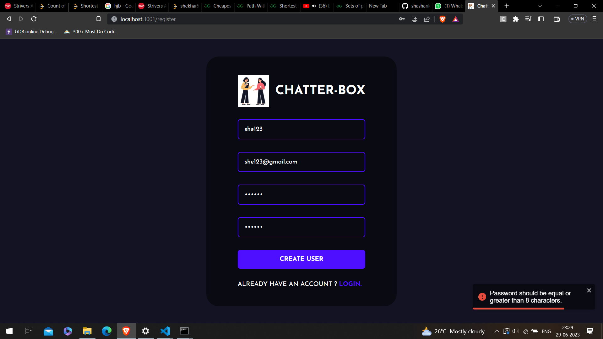
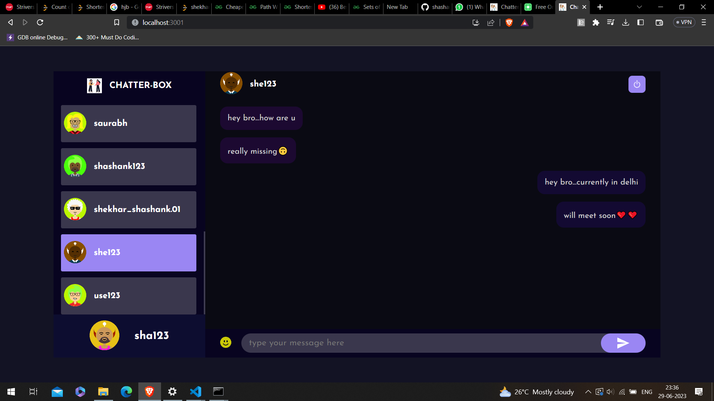
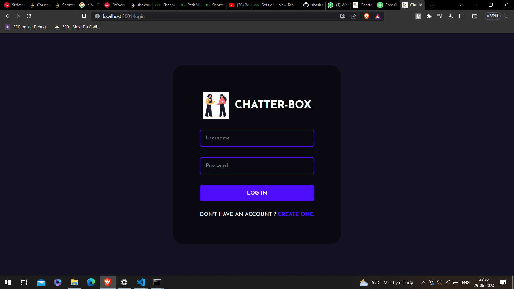
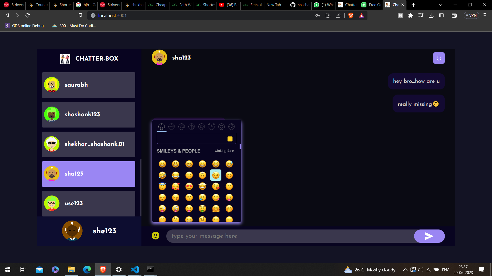

# Chatter Box

## Introduction:
- Chatter Box is a realtime Chat App with login/signup feature.

- Here you can choose your dynamic avatar as a display picture from multiavatar API.

## Technology Stack:
  1) MongoDB
  2) Multiavatar API
  3) ReactJS
  4) ExpressJS
  5) NodeJS
  6) Socket.io
  
## To start with the application first download the zip or clone it, then :- 

- Go to server side by cd server.
- Install the npm modules by npm i.
- Go to client side by cd public.
- Install the npm modules for frontend by npm i.
- Create your own .env file.
- Start the backend server by npm run start and react by npm start.
- The app will get started. 

## Screenshots

